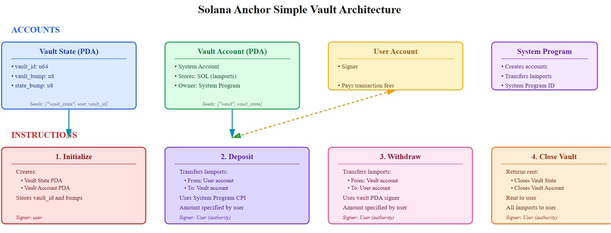
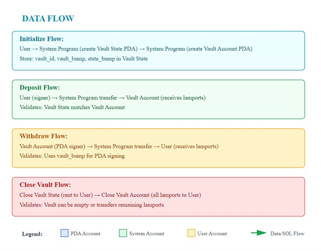

# Project Description
Ackee Vault - Store your SOL in Different vaults securely


**Deployed Frontend URL:** https://ackee-vault.vercel.app

**Solana Program ID:** Devnet -  8gjd6dv9RAfYuvEqeDzF4EM72SoKaFjbxeYATyNuYkth
https://explorer.solana.com/address/8gjd6dv9RAfYuvEqeDzF4EM72SoKaFjbxeYATyNuYkth?cluster=devnet 

## Project Overview

### Description
A simple vault on Solana to store SOL. Each User can create many vaults and deposit, withdraw lamports in them for different pupose like you can open many Recurring deposit for different occassions or needs in Fiat Currency in a Bank.
If Users feels a particular vault is not required in future, it can be closed to recover the rent.
Another user cannot deposit or withdraw from other users vault. This dApp demonstrates basic Solana program development concepts including PDAs, account creation, and state management.

### Key Features
- **Create Vault using ID**: Initialize a new counter account for your wallet
- **Mutiple Vaults for a User** : User can create multiple vaults by using different vault ID
- **Deposit Lamports**: Add lamports to your chosen vaults. All user vaults are shown in UI.
- **Withdraw Lamports**: User can withdraw lamports from chosed vault.
- **Close Vault Account**: Close the vault to recover lamports and the rent amount. Vault accont will be closed and removed from UI.


### How to Use the dApp
1. **Connect Wallet** - Connect your Solana wallet
2. **Initialize Vault** - Enter Vault ID and press button Initialize Vault.
3. **Deposit** - Enter the Deposit lamports amount and  clcik the "Deposit" button to deposit lamports in the vault.
4. **Withdraw** - Enter the Withdraw lamports amount and  clcik the "Withdraw" button to withdraw lamports from the vault.
5. **Close Vault** - Press close button to closed Vault account.

## Program Architecture

The Ackee Vault dApp uses a simple architecture with two PDA account(Vault State, Vault) type and four core instructions(Initialize, Deposit, Withdraw, Close). The program leverages PDAs to create Vault accounts for each user which can be operated by User only creating vaults, ensuring data isolation and preventing loss of lamports due to unauthorized access.

### PDA Usage

The program uses Program Derived Addresses to create deterministic counter accounts for each user.

**PDAs Used:**
- **Vault State PDA**: Derived from seeds `["vault_state", user, vault_id]` - ensures each user has a unique vault account for each vauld_id that only they can modify.

### Program Instructions
**Instructions Implemented:**
- **Initialize**: Creates a new vault.
- **Deposit**: Deposit lamports in selected vault.
- **Withdraw**: Withdraw lamports from selected vault.
- **Close Vault**: close vault account and transfer rent & lamports back to user.

### Account Structure
```rust
#[account]
#[derive(InitSpace)]
pub struct VaultState {
    pub vault_id: u16,
    pub vault_bump: u8,
    pub state_bump: u8,
}
```

## Testing

### Test Coverage
Comprehensive test suite covering all instructions with both successful operations and error conditions to ensure program security and reliability.

**Happy Path Tests:**
- **Initialize Vault**: Successfully creates a new counter account with correct initial values
- **Deposit**: Properly increases count and total_increments by 1
- **Withdraw**: Sets count to 0 while preserving owner and total_increments
- **Close Vault**: Sets count to 0 while preserving owner and total_increments

**Unhappy Path Tests:**
- **Initialize Duplicate Vault**: Fails to initialize a Vault with Id that already exists
- **Deposit in Others Vault**: Fails when non-owner tries to Deposit in someone else's Vault
- **Withdraw Unauthorized**: Fails when non-owner tries to withdraw from others vault.
- **Close other's vault**: Fails when trying to close someone else's Vault


### Running Tests
```bash
yarn install    # install dependencies
anchor test     # run tests
```


