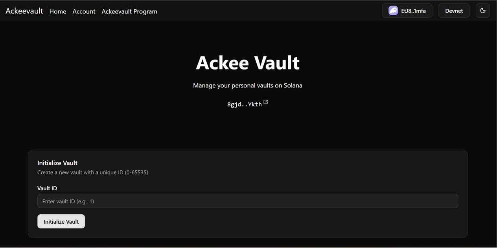
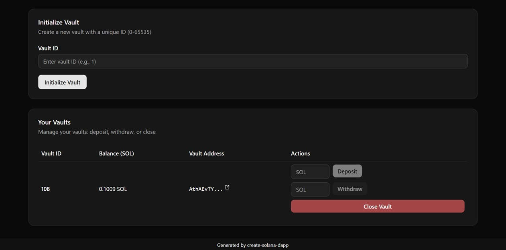

# Project Description
Ackee Vault - Stora your SOL in Different vaults securely



**Deployed Frontend URL:** https://ackee-vault.vercel.app

**Solana Program ID:** Devnet -  8gjd6dv9RAfYuvEqeDzF4EM72SoKaFjbxeYATyNuYkth
https://explorer.solana.com/address/8gjd6dv9RAfYuvEqeDzF4EM72SoKaFjbxeYATyNuYkth?cluster=devnet 

## Project Overview

### Description
A simple vault on Solana to store SOL. Each User can create many vaults and deposit, withdraw lamports in them for different pupose like you can open many Recurring deposit for different occassions or needs in Fiat Currency in a Bank.
If Users feels a particular vault is not required in future, it can be closed to recover the rent.
Another user cannot deposit or withdraw from other users vault. This dApp demonstrates basic Solana program development concepts including PDAs, account creation, and state management.

### Key Features
- **Create Vault using ID**: Initialize a new counter account for your wallet
- **Mutiple Vaults for a User** : User can create multiple vaults by using different vault ID
- **Deposit Lamports**: Add lamports to your chosen vaults. All user vaults are shown in UI.
- **Withdraw Lamports**: User can withdraw lamports from chosed vault.
- **Close Vault Account**: Close the vault to recover the rent amount. Vault accont will be closed and removed from UI.



### How to Use the dApp
1. **Connect Wallet** - Connect your Solana wallet
2. **Initialize Vault** - Enter Vault ID and press button Initialize Vault.
3. **Deposit** - Enter the Deposit lamports amount and  clcik the "Deposit" button to deposit lamports in the vault.
4. **Withdraw** - Enter the Withdraw lamports amount and  clcik the "Withdraw" button to withdraw lamports from the vault.
5. **Close Vault** - Press close button to closed Vault account.

## Program Architecture
The Counter dApp uses a simple architecture with one main account type and three core instructions. The program leverages PDAs to create unique counter accounts for each user, ensuring data isolation and preventing conflicts between different users' counters.

### PDA Usage
The program uses Program Derived Addresses to create deterministic counter accounts for each user.

**PDAs Used:**
- **Counter PDA**: Derived from seeds `["counter", user_wallet_pubkey]` - ensures each user has a unique counter account that only they can modify

### Program Instructions
**Instructions Implemented:**
- **Initialize**: Creates a new counter account for the user with initial value of 0
- **Increment**: Increases the counter value by 1 and tracks total increments
- **Reset**: Sets the counter value back to 0 while preserving the owner information

### Account Structure
```rust
#[account]
pub struct Counter {
    pub owner: Pubkey,        // The wallet that owns this counter
    pub count: u64,           // Current counter value
    pub total_increments: u64, // Total number of times incremented (persists through resets)
    pub created_at: i64,      // Unix timestamp when counter was created
}
```

## Testing

### Test Coverage
Comprehensive test suite covering all instructions with both successful operations and error conditions to ensure program security and reliability.

**Happy Path Tests:**
- **Initialize Counter**: Successfully creates a new counter account with correct initial values
- **Increment Counter**: Properly increases count and total_increments by 1
- **Reset Counter**: Sets count to 0 while preserving owner and total_increments

**Unhappy Path Tests:**
- **Initialize Duplicate**: Fails when trying to initialize a counter that already exists
- **Increment Unauthorized**: Fails when non-owner tries to increment someone else's counter
- **Reset Unauthorized**: Fails when non-owner tries to reset someone else's counter
- **Account Not Found**: Fails when trying to operate on non-existent counter

### Running Tests
```bash
yarn install    # install dependencies
anchor test     # run tests
```

### Additional Notes for Evaluators

This was my first Solana dApp and the learning curve was steep! The biggest challenges were figuring out account ownership validation (kept getting unauthorized errors) and dealing with async transaction confirmations. PDAs were confusing at first but once they clicked, the deterministic addressing made everything much cleaner.
